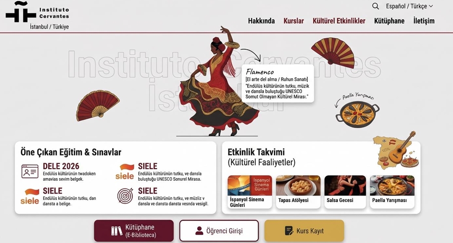

# Instituto Cervantes Web Portal – Mobile UX & Accessibility Case Study

> **Disclaimer:** This case study is an independent technical audit and conceptual UI/UX proposal. It is not officially affiliated with, endorsed by, or commissioned by Instituto Cervantes.


---

## Overview

This case study presents an independent **front-end, mobile UX, and accessibility analysis** of the Instituto Cervantes de Estambul web portal, together with a responsive UI/UX redesign proposal.

The study focuses on identifying legacy layout constraints in the public-facing interface and proposing a more modern, touch-friendly, and responsive experience while minimizing disruption to the underlying CMS structure.

- **Author:** Remziye Azra Sifil — Software Engineering Student
- **Target Institution:** Instituto Cervantes de Estambul
- **Date:** August 2026
- **Original Report Language:** Spanish
- **Focus:** Front-End Architecture, Mobile Responsiveness, Accessibility, DOM/CSS, Touch UX

---

## Technical Audit & Source Code Analysis

A developer-tools inspection of the public front-end identified several structural and usability constraints affecting mobile interaction.

### 1. Viewport & Responsive Layout

The inspected interface showed no effective mobile viewport configuration such as:

```html
<meta name="viewport" content="width=device-width, initial-scale=1.0">
```

The interface also contains fixed-width containers, including:

```html
<div style="width: 1000px;">
<div id="CapaNum0" style="width: 972px;">
<div id="CapaNum1" style="width: 220px;">
```

Fixed pixel dimensions can restrict fluid adaptation across modern mobile viewport sizes such as 360px–430px.

### 2. Legacy Layout Constraints

The interface relies extensively on older positioning techniques, including:

```css
position: absolute;
top: 191px;
left: 774px;
float: left;
```

Combined with extensive inline CSS, these patterns make responsive adaptation more difficult and can contribute to content overlap, horizontal overflow, and inconsistent positioning on smaller screens.

### 3. Client-Side Layout Handling

The page also uses several JavaScript functions triggered during body loading:

```html
<body onload="redimIMG(); RedimCapas(); TargetBlank(); init(); focus(); cambiaenlaces()">
```

Dynamic layout manipulation of this kind increases the complexity of responsive behavior and may require additional client-side processing during page initialization.

### 4. Usability & Touch Interaction

The mobile experience presents several usability concerns:

- Small navigation and interaction areas
- Desktop-oriented navigation structures
- Difficult text scanning on narrow screens
- Limited adaptation of content blocks to mobile widths
- Reliance on pinch-to-zoom for some content

These issues can make navigation and content discovery less comfortable on touch-based devices.

---

##  Proposed Architecture & UI/UX Redesign

The redesign focuses on **progressive front-end improvements** that can coexist with the existing content structure.

### 1. Modular Grid & Flexbox Flow

Rigid positioning is replaced with modern responsive layout techniques:

- CSS Grid for structured content sections
- Flexbox for adaptive component layouts
- Fluid widths instead of fixed pixel containers
- Vertical stacking of desktop cards on mobile

Example:

```css
@media (max-width: 768px) {
    .card-container {
        flex-direction: column;
    }
}
```

This allows desktop-oriented content groups such as **Featured Exams & Courses** and **Cultural Calendar** to transition into a more readable vertical layout on mobile devices.

### 2. Touch-Optimized Mobile Navigation

The desktop navigation is reorganized into a mobile-friendly hamburger menu.

Primary actions such as:

- Biblioteca
- Acceso a estudiantes
- Matrícula de cursos

are given larger interactive areas, targeting approximately **48 × 48 CSS pixels** to improve touch accessibility.

### 3. Interactive Cultural Hero Section

The redesign incorporates the institution's cultural identity directly into the interface.

Interactive elements introduce themes such as:

- Flamenco
- Spanish gastronomy
- Cultural events

These elements can provide short cultural information through lightweight tooltips, pop-ups, or interactive cards.

### 4. Mobile Cultural Events

Cultural events are reorganized into a swipe-friendly carousel on mobile.

This allows users to browse upcoming activities horizontally without navigating through dense, desktop-oriented content structures.

---

##  Redesign Preview



*Figure: Responsive concept featuring modular content sections, touch-friendly navigation, and cultural micro-interactions.*

---

##  Full Assessment Report

The complete **4-page technical assessment and redesign proposal** was authored in Spanish to align with the institution's cultural and linguistic context.

 **[View Full Spanish PDF Report](./Cervantes_Istanbul_UX_Propuesta.pdf)**

---

##  Key Technologies & Concepts

- HTML5
- CSS3
- CSS Grid
- Flexbox
- Responsive Web Design
- Mobile UX
- Accessibility
- DOM/CSS Analysis
- Touch Interaction Design
- UI/UX Prototyping

---

##  Project Structure

```text
.
├── mockup_preview.png
├── Cervantes_Istanbul_UX_Propuesta.pdf
├── README.md
└── LICENSE
```

---

##  Future Improvements

- WCAG-based accessibility testing
- Automated Lighthouse performance audits
- Keyboard navigation improvements
- Screen-reader compatibility testing
- Responsive typography system
- Progressive image optimization
- Multilingual UX improvements
- Usability testing with mobile users
- Component-based design system
- Performance monitoring across different devices and network conditions

---

##  License & Intellectual Property

© 2026 Remziye Azra Sifil. All rights reserved.
This case study, visual concept, and original analysis are licensed under the **Creative Commons Attribution-NonCommercial-NoDerivatives 4.0 International License**.

**CC BY-NC-ND 4.0**

You may share and inspect this work for educational and evaluation purposes with proper attribution.

Commercial use and distribution of modified versions are not permitted without explicit permission.

[View License Details](https://creativecommons.org/licenses/by-nc-nd/4.0/)
